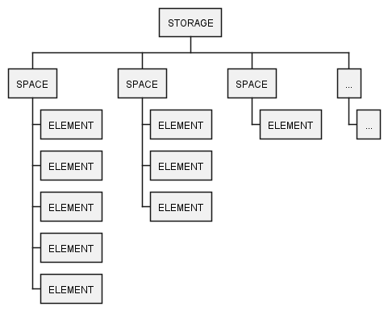

# Storage API

Вариант абстрактного представления хранения информации и доступа к ней.

### Концептуальная схема

### Принцип формирования ELEMENT в SPACE

__SPACE__

|            | SPACE PROPERTY #1 | SPACE PROPERTY #2 | SPACE PROPERTY #3 | ... |
|------------|-------------------|-------------------|-------------------|-----|
| ELEMENT #1 | [value]           | [value]           | [value]           | ... |
| ELEMENT #2 | [value]           | [value]           | [value]           | ... |
| ELEMENT #3 | [value]           | [value]           | [value]           | ... |
| ...        | [value]           | [value]           | [value]           | ... |

### Основы

Storage API описывает не физический способ хранения информации, а логический. Т.е. на самом деле не важно, как будет существовать информации в своей среде, Storage API позволяет абстрагироваться от этого и работать с ней
одинаково, независимо от того где и как эта информация существует. При этом, нужно понимать следующие вещи:

* __[Storage](src/main/java/ru/rds/data/storage/Storage.java)__ - это корневой объект. Он может состоять из неограниченного количества Space. Имеет все необходимые инструменты для управления своих Space.
* __[Space](src/main/java/ru/rds/data/storage/Space.java)__ - это объект, который позволяет группировать и описывать структуру всех относящихся к нему Element. Имеет все необходимые инструменты для управления Element.
* __[Element](src/main/java/ru/rds/data/storage/Element.java)__ - это основной объект. Он обладает всеми свойствами Space, к которому относится, и содержит их значения. Имеет все необходимые инструменты для управления значениями, которые хранит.

Чтобы легче понять саму концепцию, можно представить как применить Storage API для работы с какой-либо реляционной базой данных. Условно представим, что:

* __Storage__ будет реализовывать саму базу данных и механизмы для работы с Таблицами;
* __Space__ будет реализовывать Таблицу базы данных и механизмы для управления её строками, при этом Таблица будет состоять из столбцов (__[SpaceProperty](src/main/java/ru/rds/data/storage/SpaceProperty.java)__);
* __Element__ будет реализовывать строку таблицы, при этом будет содержать значения столбцов той таблицы, к которой относится.

Таким образом, вышеописанное позволяет понять один из варинтов использования Storage API. Но это лишь один из вариантов. Вы можете реализовать различные варианты хранения информации и доступа к ней, но использовать
единое API для управления всеми этими вариантами. Возможно, кому-то поможет и упростит жизнь =)

### Требования
- [JDK 8](https://openjdk.org/projects/jdk/8/)